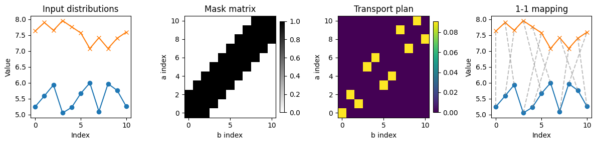
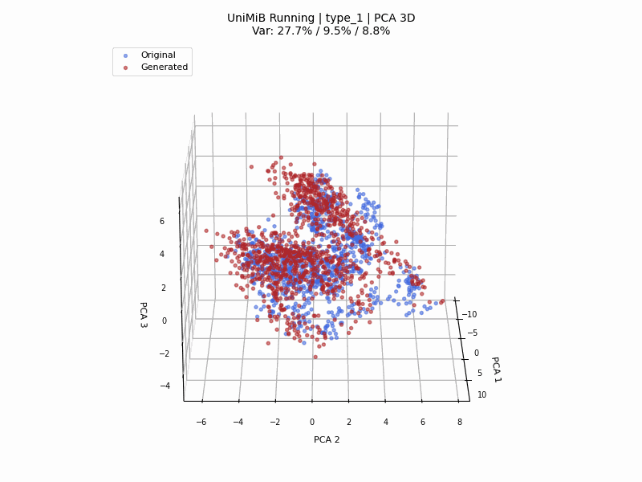

# TMW

Temporal Masked Wasserstein (TMW) provides time-series distance and loss functions
based on masked optimal transport. The repo includes PyTorch-ready wrappers,
dataset loaders, and experiment notebooks for KNN benchmarking and GAN training.



## Project Overview

- Core TMW distance and loss implementations live in `tmw_package/`.
- `distances.py` and `losses.py` expose easy-to-use wrappers for multiple
  time-series distances (TMW, OPW, TAOT, TCOT, AWSWD, SDTW, OTW, DTW, etc.).
- `datasets/` offers simple loaders for UCR-style text files and a folder-based
  dataset loader for `consolidated_datasets/`.
- `test_*` folders contain runnable notebooks for KNN benchmarks and GAN
  training/ablation studies.

## Directory Structure

```
tmw_package/                 # Core TMW implementation (distance + loss)
datasets/                    # Dataset loader utilities
dtw_mine/                    # Other OT/DTW variants used by the wrappers
consolidated_datasets/       # Local datasets (UCR/UEA, UniMiB-SHAR, PTB-DB, etc.)
distances.py                 # Distance wrapper (TimeSeriesDistance)
losses.py                    # Loss wrapper (TimeSeriesLoss)
requirements.txt             # Python dependencies
test_knn/                    # Univariate UCR KNN benchmarks
test_knn_multivariate/       # Multivariate UEA + local KNN benchmarks
test_knn_ablation/           # TMW eps_threshold/reg ablation (KNN)
test_ucb_abnormal/           # GAN training on PTB-DB abnormal
test_ucb_normal/             # GAN training on PTB-DB normal
test_ucb_ablation_type_1/    # TMW hyperparameter ablation (mask_type=1)
test_ucb_ablation_type_2/    # TMW hyperparameter ablation (mask_type=2)
test_unimib_jumping/         # GAN training on UniMiB-SHAR jumping
test_unimib_running/         # GAN training on UniMiB-SHAR running
examples/                    # Misc notebooks
image_generate/              # Plotting notebooks and outputs
```

## Test Folder Guides

| Folder | Purpose | README |
| --- | --- | --- |
| test_knn/ | Univariate UCR KNN benchmarks | [test_knn/README.md](test_knn/README.md) |
| test_knn_multivariate/ | Multivariate UEA + local KNN benchmarks | [test_knn_multivariate/README.md](test_knn_multivariate/README.md) |
| test_knn_ablation/ | TMW eps_threshold/reg ablation (KNN) | [test_knn_ablation/README.md](test_knn_ablation/README.md) |
| test_ucb_abnormal/ | GAN training on PTB-DB abnormal | [test_ucb_abnormal/README.md](test_ucb_abnormal/README.md) |
| test_ucb_normal/ | GAN training on PTB-DB normal | [test_ucb_normal/README.md](test_ucb_normal/README.md) |
| test_ucb_ablation_type_1/ | TMW hyperparameter ablation (mask_type=1) | [test_ucb_ablation_type_1/README.md](test_ucb_ablation_type_1/README.md) |
| test_ucb_ablation_type_2/ | TMW hyperparameter ablation (mask_type=2) | [test_ucb_ablation_type_2/README.md](test_ucb_ablation_type_2/README.md) |
| test_unimib_jumping/ | GAN training on UniMiB-SHAR jumping | [test_unimib_jumping/README.md](test_unimib_jumping/README.md) |
| test_unimib_running/ | GAN training on UniMiB-SHAR running | [test_unimib_running/README.md](test_unimib_running/README.md) |

## Notebooks

- The 3D embedding plots using PCA and t-SNE are in
	[image_generate/single_3d_type_dataset_embedding.ipynb](image_generate/single_3d_type_dataset_embedding.ipynb).
- Setting `SAVE_GIF = True` in the config cell exports a rotating 360° GIF
  (72 frames at 20 fps) to `image_generate/outputs/`.
- Notebook usage guide: [image_generate/README.md](image_generate/README.md)

## Installation

1. Create and activate a Python environment.
2. Install dependencies:

```bash
pip install -r requirements.txt
```

## Usage Examples

### 1) Compare distances with TMW

```python
import torch
from distances import TimeSeriesDistance

# Batch of time series: (batch, seq_len, dims)
x = torch.randn(8, 50, 1)
y = torch.randn(8, 50, 1)

tmw = TimeSeriesDistance(
	"tmw",
	distance_params={
		"mask_type": 2,
		"eps_threshold": 0.2,
		"reg": 0.01,
		"max_iterations": 2000,
		"rescale": True,
	},
)

distances = tmw(x, y)
print(distances.shape)  # (8,)
```

### 2) Use TMW as a differentiable training loss

```python
import torch
from losses import TimeSeriesLoss

model = torch.nn.Sequential(
	torch.nn.Linear(20, 64),
	torch.nn.ReLU(),
	torch.nn.Linear(64, 20),
)

loss_fn = TimeSeriesLoss(
	"tmw",
	{
		"mask_type": 2,
		"eps_threshold": 0.1,
		"reg": 0.01,
		"max_iterations": 500,
		"rescale": True,
	},
)

optimizer = torch.optim.Adam(model.parameters(), lr=1e-3)

x = torch.randn(32, 20)
target = torch.randn(32, 20)

# Convert to (batch, seq_len, dims)
pred = model(x).unsqueeze(-1)
true = target.unsqueeze(-1)

loss = loss_fn(pred, true)
loss.backward()
optimizer.step()
```

### 3) Load datasets

#### a) Load from a folder in `consolidated_datasets/`

```python
from datasets import DatasetLoader

loader = DatasetLoader(data_root="consolidated_datasets/aeon_datasets")
X_train, y_train = loader.load_dataset("CBF", split="TRAIN")
X_test, y_test = loader.load_dataset("CBF", split="TEST")
```

#### b) Load UEA/UCR via aeon (similar to the KNN notebooks)

```python
from aeon.datasets import load_classification

X_train, y_train = load_classification(
	"BasicMotions", split="train", extract_path="consolidated_datasets/aeon_datasets"
)
X_test, y_test = load_classification(
	"BasicMotions", split="test", extract_path="consolidated_datasets/aeon_datasets"
)
```

#### c) Load a UCR-format text file directly

```python
from datasets import load_ucr_dataset

X, y = load_ucr_dataset("consolidated_datasets/aeon_datasets/CBF/CBF_TRAIN.txt")
```

## TMW Hyperparameters

Defaults below reflect the wrapper defaults used by `TimeSeriesDistance` and
`TimeSeriesLoss`.

| Parameter | What it controls | Default |
| --- | --- | --- |
| `cost_function` | Cost type for pairwise points | `"L2"` |
| `mask_type` | Temporal mask type (1 = index-based, 2 = cumulative-distance) | `1` |
| `reg` | Sinkhorn regularization strength | `0.01` |
| `max_iterations` | Sinkhorn max iterations | `1000` |
| `thres` | Sinkhorn convergence threshold | `1e-5` |
| `eps_threshold` | Mask threshold | `0.1` |
| `masked` | Enable temporal mask | `True` |
| `rescale` | Rescale temporal coordinates | `False` |

Note: the NumPy API in [tmw_package/temporal_masked_OT.py](tmw_package/temporal_masked_OT.py)
uses different defaults (e.g., `algorithm="linear_programming"`, `reg=0.0001`,
`max_iterations=100000`).

## 3D Render

The interactive 3D plot is generated by the embedding notebook and can be viewed directly in the notebook.

- Notebook: [image_generate/single_3d_type_dataset_embedding.ipynb](image_generate/single_3d_type_dataset_embedding.ipynb)

